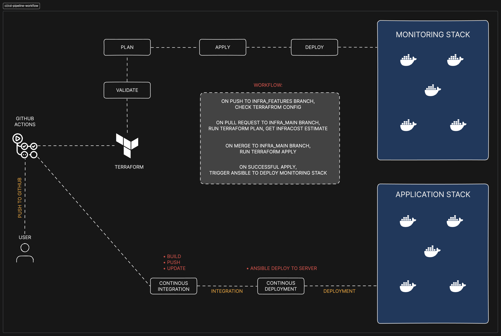

# Continous Integration And Continous Deployment Of A Full-Stack Docker-Compose Application

## Project Overview

This repository contains the infrastructure and application setup for deploying a highly automated and scalable environment using Terraform, Ansible, and Docker Compose. It also includes CI/CD pipelines that handle infrastructure provisioning and application deployment seamlessly.

### Branch Structure
__Infrastructure Pipelines__
infra_features: For developing and testing infrastructure changes.
infra_main: The main branch for provisioning and managing infrastructure.

__Application Pipelines__
integration: For building and testing application artifacts.
deployment: For deploying the application stack to the provisioned infrastructure.

### Workflow Overview
__Infrastructure Pipeline__
Push to `infra_features`
1. Run terraform validate to check the correctness of configurations.

Pull Request to `infra_main`
1. Trigger terraform plan to preview infrastructure changes.
2. Output the Terraform plan as a comment in the PR.
3. Include cost estimation using InfraCost.

Merge to infra_main
1. Run terraform apply with auto-approval to provision resources.
2. Trigger Ansible to deploy the monitoring stack on the provisioned infrastructure.

__Application Pipeline__
Push to `integration`
1. Build and tag Docker images for the application.
2. Push the images to a public Docker Hub repository.
3. Update `docker-compose.yml` with the new image tags and commit the changes.

Merge from `integration` to `deployment`
1. Deploy the updated application stack to the provisioned infrastructure using Docker Compose.

### Prerequisites
__Tools and Platforms__
Ensure the following tools are installed and configured:
- Terraform (v1.5+)
- Ansible (v2.12+)
- Docker and Docker Compose
- GitHub Actions for CI/CD
- InfraCost account for cost estimation

__Environment Setup__
- An active cloud account (e.g., AWS, Azure, or GCP) with necessary permissions.
- A Docker Hub account for hosting application images.
- Configured SSH access to the target infrastructure.

_Architecture Diagram_

## CI/CD Pipeline Details
__Infrastructure Pipeline__
GitHub Actions Workflow
- Terraform Validation: Ensures configurations are syntactically correct.
- Terraform Planning: Generates a plan for infrastructure changes with cost estimation.
- Terraform Apply: Automatically provisions infrastructure upon merging.
- Ansible Deployment: Deploys monitoring stack after resources are provisioned.

__Application Pipeline__
- GitHub Actions Workflow
- Build and Push Docker Images: Automates Docker image creation and uploads to Docker Hub.
- Update docker-compose.yml: Ensures the latest image tags are used.
- Application Deployment: Deploys the application stack on the infrastructure using Docker Compose.

### Key Features
1. Infrastructure as Code (IaC): Uses Terraform for automated infrastructure provisioning.
2. Configuration Management: Utilizes Ansible for deploying and managing monitoring stacks.
3. Dockerized Application: Ensures consistent application environments using Docker.
4. CI/CD Integration: Fully automated workflows for testing, provisioning, and deployment.
5. Cost Estimation: Integrates InfraCost to provide actionable cost insights during PRs.

## How to Use
__Setting Up the Infrastructure__
1. Clone the repository and create a new branch from infra_features.
2. Make desired changes to the Terraform files.
3. Push changes to infra_features and create a PR to infra_main.
4. Review the Terraform plan and cost estimation.
5. Merge the PR to provision resources and deploy the monitoring stack.

__Deploying the Application__
1. Clone the repository and create a new branch from integration.
2. Update application code or configurations as needed.
3. Push changes to integration to trigger the Docker build pipeline.
4. Merge integration into deployment to deploy the updated stack.

## changes diff from repo code
-- variables file
-- providers file
-- vm module, added file to public key link
